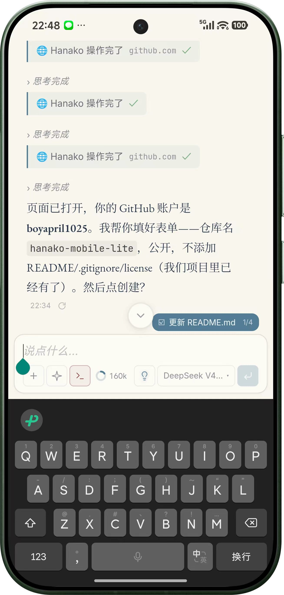
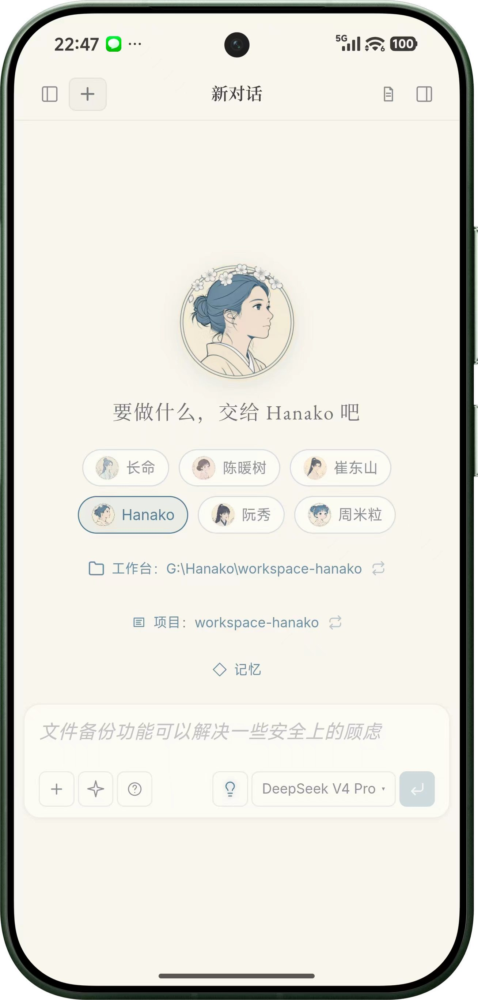

# Hanako Mobile Lite V0.1.5

> **版权声明**  
> 本项目是一个 Android WebView 壳应用，内部加载的是 [liliMozi](https://github.com/liliMozi) 开发的 [OpenHanako](https://github.com/liliMozi/openhanako) 移动端 Web 界面。  
> **本项目的作者不拥有 OpenHanako 的任何版权。** OpenHanako 的所有权利归 liliMozi 所有。

我要再一次感谢 liliMozi 开发了这么好用的软件。审美和实用都长在我的点上。

我是一个完全不懂代码的人，但在大约一周的时间里，我和我的 Agent 伙伴们一起做了很多事情——也包括这个壳。

做这个壳的初衷，是我不太习惯在浏览器里使用应用。一些交互细节不太合我的习惯：手势返回、强同步、换行就是换行而不是发送……于是就请我的 Agent 伙伴们做了这个壳。全程由 Agent 伙伴开发，我只负责提修改意见。

主要有三位 Agent 伙伴参与：**阮秀**（MiMo V2.5 Pro）、**Hanako**（DeepSeek V4 Pro）、**长命**（GPT-5.5）。因为这个项目的主体是阮秀开发的，我就用她的头像做了 App 图标。

感谢我的 Agent 伙伴们。也再次感谢 liliMozi，给了我遇见这些伙伴的机会。

---

## 应用截图

,

---

Hanako 移动端轻量壳应用。基于 Android WebView，为本地运行的 Hanako 实例提供沉浸式移动体验。

## 当前状态

- **版本**：V0.1.5 调试构建
- **目标设备**：Android 16 / API 36.1
- **构建系统**：Kotlin + Gradle 原生 Android 项目
- **默认地址**：`http://192.168.31.11:14500/mobile/`
- **验证状态**：真机测试通过

## V0.1.5 新增特性（基于 V0.1）

### 界面与体验
- 沉浸式全屏显示，系统状态栏和导航栏适配主题色
- 底部上拉刷新，带动画旋转指示器
- 自适应应用图标，覆盖 mdpi 至 xxxhdpi 全部密度

### 移动端交互优化
- **多层级返回导航**：返回手势遵循导航栈——文件预览 → 工作台面板 → 侧边栏 → 退出应用，不再误触退出
- **选中即关闭**：从聊天列表选择会话后侧边栏自动收起，符合移动端操作习惯
- **回车换行**：在 ProseMirror/Tiptap 编辑器中回车键插入换行而非发送消息

### 技术改进
- 文件选择器支持（`WebChromeClient.onShowFileChooser`）
- 服务器地址动态配置对话框（持久化到 SharedPreferences）
- 访问密钥自动填充
- 所有 JS 注入均使用单行 `loadUrl("javascript:...")` 方案，规避 WebView 的 `evaluateJavascript` IPC 异常

## V0.1 已有功能

- Android WebView 壳
- 固定 URL 白名单
- 局域网 HTTP 明文支持
- Cookie 与 DOM 存储启用
- 原生错误页面与重试按钮
- 返回键优先回退 WebView 历史
- 主框架错误安全处理

## V0.1 暂不包含

以下功能有意延后：

- 原生聊天 UI
- 推送通知
- 后台保活
- 文件上传/下载应用集成
- 正式发布签名

## 目录结构

```text
hanako-mobile-lite-v0.1/
  android-shell/        # Android WebView 壳项目（Kotlin + Gradle）
  docs/                 # 项目笔记与发布说明
  logs/                 # 开发日志
  README.md             # 本文件
```

## 构建环境

- JDK 17
- Android SDK Platform 36.1
- Android SDK Build Tools 36.1.0
- Gradle Wrapper 8.14.5

## 构建

```powershell
cd android-shell
.\gradlew.bat assembleDebug --no-daemon
```

输出 APK：

```text
android-shell/app/build/outputs/apk/debug/hanako-mobile-lite-v0.1.5-debug.apk
```

## 安装

```powershell
cd android-shell
adb install -r app\build\outputs\apk\debug\hanako-mobile-lite-v0.1.5-debug.apk
```

手机需能通过局域网访问 Hanako 宿主机：

```text
http://192.168.31.11:14500/mobile/
```

## JS 注入架构

V0.1.5 在 `MainActivity.onPageFinished` 中通过 `loadUrl("javascript:...")` 注入多段 JS，弥合 WebView 壳与 React 移动端界面之间的交互差异：

| 注入标识 | 用途 |
|---------|------|
| `__hanaBoot` / `__hanaDomReady` | 启动引导：轮询 DOM 就绪状态，后续注入依赖此信号 |
| `__hanaHandleBack` | 多层级返回导航，优先级：预览 → 工作台 → 侧边栏 → 退出 |
| `__hanaEnterFix` | 回车键拦截：在 window 层捕获 keydown，通过 ProseMirror view API 插入换行 |
| `__hanaAutoCloseSb` | 侧边栏内点击检测，选中会话后自动关闭 |
| 上拉刷新 | 底部上拉手势触发 `window.location.reload()` |
| `__hanaAccessKey` | 从 SharedPreferences 读取访问密钥并自动填充 |

## 注意事项

- 使用 `loadUrl("javascript:...")` 而非 `evaluateJavascript`，因为后者在 `onPageFinished` 期间会跑在 `about:blank` 而非渲染页面上
- `loadUrl` 的 URL 解析器遇到真实换行符（`\n`）会截断，所有注入 JS 必须单行书写并注意 Kotlin 字符串转义
- 当前服务器地址为硬编码，可在运行时通过设置对话框修改
